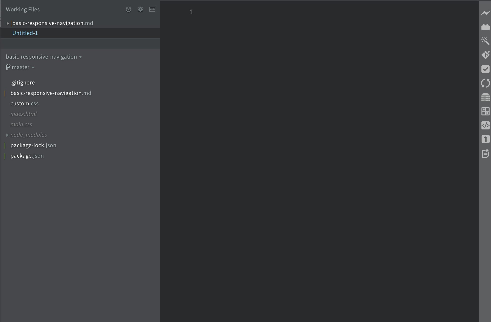
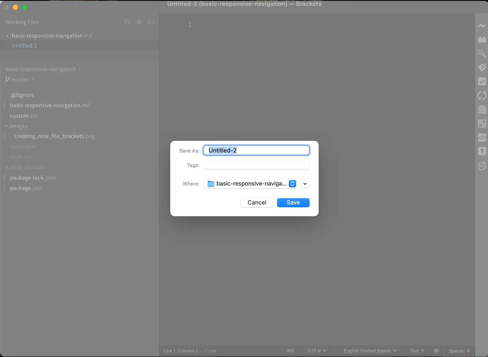
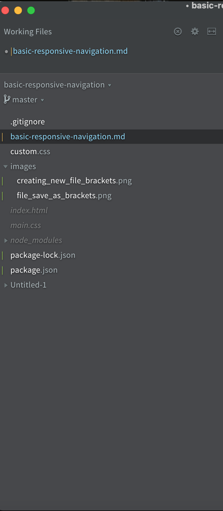

<h1 class="capitalize">COMD2451</h1>
<h2 class="capitalize center">Basic Responsive Site Navigation</h2>

---

<section class="section">
    <h2 class="sentence">The nav element: basic HTML markup</h2>

As ***discussed*** in the `slide deck` [COMD2451 Sectioning HTML Documents, Adding external style sheets](https://github.com/interglobalmedia/sectioning-html/blob/master/sectioning-html.md), the `nav element` can be ***placed within*** the `header element` at the ***top*** of the `HTML document`:

```html
<nav>
    <ul>
        <li>
            <a href="/home">Home</a>
        </li>
        <li>
            <a href="/portfolio">Portfolio</a>
        </li>
        <li>
            <a href="/resume">Résumé</a>
        </li>
        <li>
            <a href="/about">About</a>
        </li>
        <li>
            <a href="/contact">Contact</a>
        </li>
    </ul>
</nav>
```

It's ***even better*** if we ***wrap*** the `nav element` in a `header element` ***like so***:

```html
<header>
    <nav>
    <ul>
        <li>
            <a href="/home">Home</a>
        </li>
        <li>
            <a href="/portfolio">Portfolio</a>
        </li>
        <li>
            <a href="/resume">Résumé</a>
        </li>
        <li>
            <a href="/about">About</a>
        </li>
        <li>
            <a href="/contact">Contact</a>
        </li>
    </ul>
</nav>
</header>
```

The ***above*** are the ***pages*** you will ***end up*** with for your `portfolio site` by the ***end*** of the `course`.

</section>

---

<section class="section">
    <h2 class="sentence">Styling the header/nav element: creating the <code>main.css</code> file</h2>
    
If we ***simply added*** `HTML markup` for the `header/nav element` ***without*** any ***styling***, ***all*** the **content** would be ***aligned*** to the ***left*** of the `HTML page `by ***default***. ***Naturally***, we ***don't want*** our `page` to ***look*** like ***that***!

<aside>
    Note: Show students what this would look like.
</aside>

In ***order*** to ***rectify*** this, we ***first*** `need` to ***create*** an ***external*** `style sheet` in ***which*** we can ***add*** our `CSS` for ***all*** of our ***pages***.

To ***do*** this, ***inside*** of the `Brackets` ***code editor*** and at the ***root*** of our `project folder`, we ***create*** a ***new*** `main.css` ***file***.

***First***, we ***have*** to ***click*** on the `File tab` in the `Brackets` ***navigation menu***, and ***select*** `New`. As a ***result***, the `Brackets` ***code editor*** `window` should ***look*** something like ***this***:

<div>
    
</div>

A ***new*** `file` ***entitled*** `Untitled-1` ***should appear*** to the ***left*** of the `Brackets` ***code editor*** `window`.

***Next***, ***right click*** on `Untitled 1`, and ***select*** *`"Save As"`* ***from*** the ***file drop down***. As a ***result***, the ***following*** should ***appear***:

<div>
    
</div>

In the *`"Save As"`* **input field**, ***type*** `main.css`. You will ***also see*** that the `file` will be ***saved*** in the ***folder*** that you are ***currently*** in, so ***make sure*** that you are ***saving*** the `file` in the ***right location***!

***After*** you have ***named*** the `file` ***inside*** the *`"Save As"`* **input field**, ***click*** on the *`Save`* **button**.

***Now***, when you ***look*** to the ***left*** of your `Brackets` ***code editor*** `window`, you ***should see*** your ***newly*** `created` `main.css` ***file***.

`Cut` and `paste` ***any*** `CSS` you have ***placed*** in the `style element` ***inside*** the `head element` of your `index.html` ***into*** your new `main.css` ***external*** `style sheet`.

</section>

---

<section class="section">
    <h2 class="sentence">Adding the external style sheet to the <code>index.html</code> head element</h2>
    
***Now*** we ***have*** to ***add*** the ***external*** `style sheet`, `main.css`, to the `head element` in our `index.html` ***file*** `using` the `link element`.

Our `link element` ***should*** be ***placed*** `below` the `title element`, and it should ***look*** something ***like*** the ***following***:

```html
<link rel="stylesheet" href="main.css">
```

Our ***next step*** will be to ***place*** this `main.css` file ***into*** a ***new*** `folder` ***entitled*** `styles` ***located*** at the ***root*** of our `project folder`.

</section>

---

<section class="section">
    <h2 class="sentence">Creating the styles folder for the main.css file</h2>
    
***Now*** we ***have*** to ***create*** a ***new*** `folder` ***called*** `styles` ***inside*** the ***root*** of our `project folder`.

In ***order*** to ***do*** that, ***inside*** the `Brackets` ***code editor*** `opened` ***from*** our `project folder` (***almost*** the `identical process` to ***our steps*** for ***creating*** the `main.css` ***file***), and ***right-click*** on the `main.css` ***file***. A ***drop down*** will ***appear***. ***Select*** `new folder`. As a ***result***, the ***following*** should ***appear*** to the ***left*** of your `Brackets` ***code editor*** `window`:

<div>
    
</div>

***Right-click*** on `Untitled 1` (or ***whatever number*** `shows up` ***for*** you), and ***select*** `Rename`. ***Rename*** the ***folder*** `styles`.

***Next***, ***drag*** the `main.css` ***file*** into the ***new*** `styles folder`.

</section>

---

<section class="section">
    <h2 class="sentence">Creating an images folder for the images from Project 1</h2>

Your `project folder` should  ***already contain*** `images` you ***used*** for `Project 1`. ***Now*** we ***want*** to ***organize*** our `folder` ***even more*** by ***adding*** a ***new*** `images folder` in ***which*** we will ***place*** those `images`. ***Follow*** the ***same*** `steps` ***made*** for ***creating*** the `styles folder `for the `main.css` ***external*** `style sheet`. The ***only difference*** will ***be*** that ***this folder*** should be ***called*** *`"images"`*.

***After*** you have ***created*** the ***folder***, ***drag*** the `images` ***into*** it.

</section>

---

<section class="section">
    <h2 class="sentence">Adding the header and its contents to your index.html</h2>
    
You ***all*** have ***already added*** a ***very simple*** `navigation menu` for ***last week***'s `Project 1` ***assignment*** regarding ***something*** you ***love***, which you ***also pushed*** to your `namecheap.com hosting`.

***Now***, it should ***look*** something like ***this***:

```html
<header>
    <nav>
    <ul>
        <li>
            <a href="/home">Home</a>
        </li>
        <li>
            <a href="/portfolio">Portfolio</a>
        </li>
        <li>
            <a href="/resume">Résumé</a>
        </li>
        <li>
            <a href="/about">About</a>
        </li>
        <li>
            <a href="/contact">Contact</a>
        </li>
    </ul>
</nav>
</header>
```

It ***should*** be ***placed*** `right below` the `opening body tag`.

</section>

---

<section class="section">
    <h2 class="sentence">Adding a CSS reset</h2>
    
***Before*** we ***add*** any ***styling*** to the `HTML elements`, we ***add*** a `CSS reset` to the ***top*** of the `main.css` ***file***.

***What*** is a `CSS reset`? The `idea` ***behind*** a `CSS reset` is to ***deal*** with ***inconsistencies*** `across browsers`.

I have ***found*** that the ***best*** `CSS reset` is the ***most*** `minimal`. That's ***because*** we ***want*** to be ***able*** to ***add*** our ***own*** `styling` to our `HTML elements` ***using*** our ***own*** `CSS selector` ***rule sets***. Buy `using` a ***large amount*** of `CSS` we ***don't*** necessarily ***even want*** to ***use*** in the ***end***, we are ***loading*** our ***project*** with ***extraneous*** and ***potentially*** `unused` *`CSS`*, ***thereby*** *`slowing down`* the ***loading*** of our `site pages` (***mentioned previously*** when we ***discussed*** `internal` ***vs*** `external style sheets`). 

The ***following*** is the `CSS reset` I ***usually add*** to my `external style sheets` at the ***top*** of the ***page***:

```css
* {
    padding: 0;
    margin: 0;
    box-sizing: border-box;
}
```
For the ***purposes*** of our `project` at ***this point*** in ***time***, we can do ***just fine*** with the ***following***:

```css
* {
    padding: 0;
    margin: 0;
}
```

***Apparently***, ***according*** to `CSS Tricks`, in their ***article*** entitled [Reboot, Resets, and Reasoning](https://css-tricks.com/reboot-resets-reasoning/), the `approach` ***right above*** is a ***favorite*** amongst ***developers***!

We will ***add*** the `box-sizing` ***property declaration*** when we ***get*** to the `CSS Box System`.

</section>

---

<section class="section">
    <h2 class="sentence">Styling the nav element: desktop</h2>
    
***Next***, we are ***going*** to ***add*** `styling` for the `nav element`, ***placing*** it in the `main.css` ***file***.

```css
nav {
    width: 100vw;
    background: #D6EFFF;
}
```

The above rule set should be ***placed below*** the `universal selector` (`*`) `rule set`.

***First*** we `target` the `width property` on the `CSS nav selector` ***with*** a ***value*** of `100vw`. Just as `vh` is a `length unit` in `CSS` (as are `px`, `em`, `rem`, and `100%`, for ***example***),  `vw` is ***also*** a `length unit`. But ***it***, like `vh`, is a `relative length unit`. It is *`relative`* to `1%` of the` viewport width`. This ***means*** that `1vw` is ***equivalent*** to `1%` of the `viewport width`. `100vw` is ***equivalent*** to `100%` of the `viewport width`.

***Again***, `relative length units` are ***great*** for `responsive design`. `Absolute length units` are ***not***. That is ***because*** `absolute length units` are ***fixed*** (they ***don't adapt*** to the ***change*** in the `viewport size`), and will ***appear exactly*** as the ***expressed dimension*** (i.e., `50px`).

***Other*** `relative length units`:

`em`: `em` is ***calculated*** as `1em = 2in`. So `1.5em` would be `3in`. And so on. `em` depends on the font on the page, and may be different for each element in the document. The em is simply the font size.

According to W3C in their article entitled [EM, PX, PT, CM, IN…](https://www.w3.org/Style/Examples/007/units.en.html),

> Expressing `sizes`, such as `margins` and `paddings`, in `em` ***means*** they are ***related*** to the `font size`, and if the `user` has a ***big font*** (e.g., on a ***big screen***) or a ***small font*** (e.g., on a `handheld device`), the `sizes` will be in ***proportion***. `Declarations` such as `text-indent: 1.5em` and `margin: 1em` are ***extremely common*** in `CSS`.
-- <cite>[EM, PX, PT, CM, IN…](https://www.w3.org/Style/Examples/007/units.en.html) -- W3C</cite>

As for the `background: #D6EFFF;` ***declaration***, it ***adds*** a `light blue` ***background*** to the `navigation menu`.

`rem`: ***stands*** for the `root em`. It is the `font size` of the `root element` of the `document`. The `root element` of the `document`, is you ***guessed*** it, the `html element`. ***Unlike*** `em`, which ***may*** be ***different*** for ***each element***, the `rem` is `constant` ***throughout*** the `document`. `1rem` is ***equivalent*** to `16px`.

</section>

---

<section class="section">
    <h2 class="sentence">Styling the ul element with Flexbox: desktop</h2>
    
The ***way*** we ***will*** be ***styling*** the `ul element` for ***desktop*** is *`interesting`*, and I think ***really cool***.

```css
ul {
    display: flex;
    justify-content: flex-end;
}
```

***Here***, we `target` the `ul selector` with a `display: flex` (`property`) `declaration`. What ***does*** this ***new*** `CSS` ***refer*** to, ***do***, and ***mean***?


The `Flexible Box Module`, ***aka*** `Flexbox`, was ***designed*** as a ***one-dimensional*** `layout model`, ***and *** as a ***method*** that ***provided*** `distribution` of ***space*** between ***items*** and ***powerful*** `alignment capabilities`.

So ***what*** does `one-dimensional` ***mean*** as ***relates*** to `Flexbox`? It ***means*** that `Flexbox` ***deals*** with `layout distribution` ***one dimension*** at a ***time***. In ***other*** words, ***either*** as a `row` or a `column`.

When we ***target*** a `CSS selector` with the `CSS property` ***declaration*** `display: flex`, it ***means*** that we are ***spatially distributing*** it `horizontally`, ***via*** the `row dimension`. `CSS selectors` are ***targeted*** via the `row dimension` by ***default***. If we ***wanted*** to ***target*** a `selector` ***via*** the `column dimension`, we would ***have*** to ***target*** the `selector` with the `flex-direction: column;` ***property declaration***. But ***here***, we ***don't want*** to `target` the `ul selector` with the `CSS property` ***value*** of `column.` We want the ***default*** `spatial distribution` of `row`.

***Next***, I ***wanted*** the `navigation menu` to be ***situated*** to the `right side` of the `nav`. That's ***where*** the `justify-content: flex-end` ***property declaration*** comes in.

The `justify-content property` is ***used*** to `align items` on the `main axis`, the ***direction*** which `flex-direction` or the ***default*** `flex behavior` of `row` ***from*** the `display: flex` ***property declaration***. In ***our*** case, the `main axis` is the `row` (or `horizontal`) `axis`.

There are `6 values` one can ***apply*** to the `justify-content` ***property***. The ***first*** is `flex-start`, which would ***place*** the` ul` ***all*** the ***way*** to the ***left*** within the `nav`. ***Next*** is the `center` ***value*** which ***places*** the `ul` right in the ***center*** of the `nav`. ***Last*** is the `flex-end` ***value***, which ***places*** the `ul` ***all*** the ***way*** to the ***right*** within the `nav`. The ***last*** `three values` we ***can apply*** to the `justify-content property` are `space-around`, `space-between`, and `space-evenly`. However, we will ***not*** be `using` them ***here***. 

To ***learn more*** about the `justify-content property`, please ***visit*** the [Basic concepts of flexbox](https://developer.mozilla.org/en-US/docs/Web/CSS/CSS_Flexible_Box_Layout/Basic_Concepts_of_Flexbox) on `MDN`.

We can ***take*** a ***look*** in the `browser` and ***see*** what our `navigation menu` ***looks like*** so ***far***.

</section>

---

<section class="section">
    <h2 class="sentence">Styling the li element: desktop</h2>
    
***Next***, we ***have*** to `style` the `li elements`. ***Right now*** there is ***very little*** `space` ***between*** the ***edges*** of the `nav` and the `content` of the `li elements`.

<aside>
    Note: we should take a look at what the navigation menu looks like at this point in the web browser.
</aside>

```css
li {
    list-style-type: none;
    margin: 2vw;
    font-size: 2.75vh;
}
```

***This*** `rule set` ***should*** be ***placed*** `right under` the `ul selector` ***rule set***.

***First*** we have the `list-style-type` ***property declaration*** with the ***value*** of `none`. What this ***means*** is that we ***don't want*** to ***display*** any `bullets` (or `numbers` in the ***case*** of an `ordered list`) to the ***left*** of the `list items`.

***Next***, we ***have*** the `margin` ***shorthand*** `property declaration` with a ***value*** of `2vw`. What this ***means*** is that we are ***applying*** a `margin-top`, `margin-right`, `margin-bottom`, and `margin-left` ***property*** with a ***value*** of `2vw` to ***all***. This ***creates*** a ***nice*** `amount` of `room` ***around*** the `list items`. But ***now*** we ***have*** to ***make*** the `font size` a ***size*** that is ***readable***. That's ***where*** the `font-size` ***property declaration*** with its ***value*** of `2.75vh` comes in.

***Now***, when we ***look*** at the ***changes*** in the ***browser***, we ***see*** that the `text` for the `list items` is ***much more*** `prominent` and ***easier*** to ***read***. But we ***do notice*** that the `text` is ***still blue*** (the ***default*** `color` for the `a element`) and is `underlined`. That ***too*** is a ***default*** (`user-agent`) `styling` for the `a element`.

</section>

---

<section class="section">
    <h2 class="sentence">Styling the a element: desktop</h2>
    
```css
a {
    text-decoration: none;
    color: black;
    padding: 2vw;
    font-family: monospace;
}
```

The ***first*** `property declaration` ***here***, `text-decoration: none;` ***removes*** the ***default*** `underline` ***from*** the `list item a element`.

The ***second*** `property declaration`, `color: black` ***changes*** the `color` of the `list item a element` ***from*** `blue` to `black`. You can ***make*** it ***whatever*** `color` you ***want***! A ***great resource*** for ***that*** is [color-hex.com](https://www.color-hex.com/color-palettes/). I ***use*** it ***all*** the ***time***.

The ***third*** `property declaration`, `padding: 2vw`, ***creates*** `padding` ***around each*** `list item a element`. It just ***spaces out*** the `list item elements` ***nicer*** than ***simply applying*** a `margin` ***around*** the `list items` ***only***.

The ***fourth*** and ***last*** `property declaration`, `font-family` ***with*** the ***value*** of `monospace`, ***applies*** a ***generic*** `monospace` ***font*** to the `list item a elements`.

<aside class="notes">
Note: We can check out the difference in layout with and without the a selector padding property declaration in the browser.
</aside>

<aside class="notes">
Note2: We can check out the difference between applying the monospace font-family property value and not applying it in the browser.
</aside>

</section>

---

<section class="section">
    <h2 class="sentence">Styling the a element with the :hover pseudo-class</h2>
    
***Next***, we ***want*** to `define` a ***special state*** of the `a element` ***using*** the `:hover pseudo-class`.

What is a `pseudo-class` in `CSS`? A `pseudo-class` is ***used*** to ***define*** a `special state` of an `element`.

**Syntax**:

```css
selector:pseudo-class {
  property: value;
}
```

`Pseudo-classes` are ***commonly used*** with `a elements`. They ***can*** be ***used*** to ***indicate*** an `unvisited a element`, a `visited a element`, ***hovering*** over an `a element` ***with*** a `mouse` or ***using*** a `key pad`, and a `selected` (`active`) `a element`.

***Below***, we are ***going*** to ***change*** the `appearance` of our `a elements` with the `:hover pseudo element`, which ***targets*** an `a element` ***when*** the` user` ***hovers*** over the `a element` with a `mouse` or `key pad`.

```css
a:hover {
    color: #2f6690;
}
```

I, ***however***, did ***not like*** the  ***dark intensity*** of the `darker blue color` on `hover`, so I ***switched*** to `using` the `rgba() function`. We ***spoke about*** the `rgb() function` ***previously*** ***vs*** `hex color codes`.

***What***, ***however***, is the [rgba() function](https://www.w3schools.com/cssref/func_rgba.asp)?

The `rgba() function` ***defines*** `colors` by the `red-green-blue-alpha (RGBA)` ***model***. The (a) `alpha` is what ***permits*** the `designer` to ***control*** the `opacity` of a `color` ***using*** the `alpha channel` (the `a` in `rgba`), which ***specifies*** the ***level*** of `opacity` of a `color`. A `value` of `1` ***represents*** `100% opacity` of a `color`, `0` ***represents*** `0 opacity`, and ***makes*** the `color` ***transparent***. ***Anything*** `in between` ***represents*** `various levels` of `opacity` of a `color`.

`RGBA` ***color values*** are an ***extension*** of the `RGB` ***color values***. The ***difference*** between the ***two*** is the `alpha channel`.

```css
a:hover {
    color: #D6EFFF;
    background: rgba(47,102,144, 0.7);
}
```

</section>

---

<section class="section">
    <h2 class="sentence">Related Resources</h2>
    
+ [Using HTML sections and outlines: MDN](https://developer.mozilla.org/en-US/docs/Web/Guide/HTML/Using_HTML_sections_and_outlines)

+ [How to create a responsive Navigation Bar with HTML, CSS and jQuery— step by step tutorial: ITNext](https://itnext.io/how-to-create-a-responsive-navigation-bar-with-html-css-and-jquery-step-by-step-tutorial-9c780b58479f)

+ [COMD2451 Sectioning HTML Documents, Adding external style sheets: Maria D. Campbell](https://github.com/interglobalmedia/sectioning-html/blob/master/sectioning-html.md)

+ [Reboot, Resets, and Reasoning: CSS Tricks](https://css-tricks.com/reboot-resets-reasoning/)

+ [Images and their backgrounds in HTML5, Relative vs Absolute Paths: Maria D. Campbell](https://github.com/interglobalmedia/image-backgrounds-rel-abs-paths/blob/master/image-backgrounds-rel-abs-paths.md)

+ [EM, PX, PT, CM, IN…: W3C](https://www.w3.org/Style/Examples/007/units.en.html)

+ [Basic concepts of Flexbox: MDN](https://developer.mozilla.org/en-US/docs/Web/CSS/CSS_Flexible_Box_Layout/Basic_Concepts_of_Flexbox)

+ [Rem in CSS: Understanding and Using rem Units: SitePoint](https://www.sitepoint.com/understanding-and-using-rem-units-in-css/)

+ [CSS :hover Selector](https://www.w3schools.com/cssref/sel_hover.asp)

+ [CSS Pseudo-classes](https://www.w3schools.com/css/css_pseudo_classes.asp)

+ [CSS rgba() Function: w3schools](https://www.w3schools.com/cssref/func_rgba.asp)

</section>